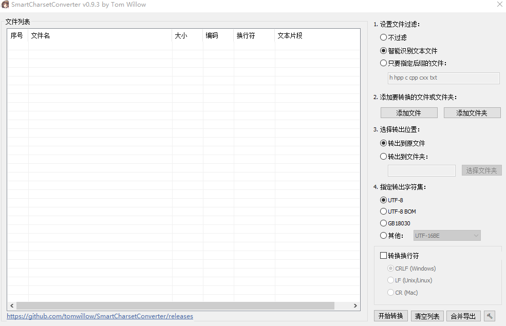

# 项目说明

有提取项目代码到同一个文本文件中再给 LLM 问答使用的场景，但碰到了项目有不同编码的文件导致提取内容部分乱码问题，为解决此问题二开了 [SmartCharsetConverter](https://github.com/tomwillow/SmartCharsetConverter)，原项目具体信息可前往主页查看。

在其基础上添加了“合并导出”的功能按钮，可将文件列表中的文件转换统一编码后，合并内容导出保存到一个文本文件中，使用文件相对文件夹的路径来分隔不同文件内容。



# 构建方法

1. 进入Developer Powershell for VS2022，配置系统代理。

2. 没有vcpkg的话要先安装
```
git clone https://github.com/microsoft/vcpkg.git
cd vcpkg
.\bootstrap-vcpkg.bat
```

3. 设置VCPKG_ROOT环境变量，用自己的vcpkg目录
```
$env:VCPKG_ROOT="YOUR:\VCPKG\PATH"
$env:PATH="$env:VCPKG_ROOT;$env:PATH"
```

进入到项目目录，执行config_on_win.bat，会自动安装vcpkg中的依赖，并进行cmake配置，首次下载要等待一段时间。

完毕后进入build目录打开SmartCharsetConverter.sln，选择项目右击即可编译生成可执行程序。
