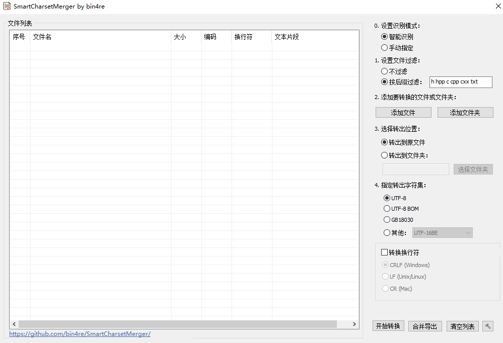

# 项目说明

有提取项目代码到同一个文本文件中再给 LLM 问答使用的场景，但碰到了项目有不同编码的文件导致提取内容部分乱码问题，为解决此问题二开了 [SmartCharsetConverter](https://github.com/tomwillow/SmartCharsetConverter)，原项目具体信息可前往主页查看。

# 功能特性

我在原项目基础上：

1. 添加了“合并导出”的功能按钮，可将文件列表中的文件转换统一编码后，合并内容导出保存到一个文本文件中，使用文件相对文件夹的路径来分隔不同文件内容。
2. 解耦了设置文件过滤和智能识别模式的耦合。
3. 添加Ctrl+A或右键点击“全选”进行批量设置编码的功能。

- **智能编码检测**：支持自动检测和手动指定文件编码格式
- **多种文件过滤**：提供无过滤和按扩展名过滤两种模式
- **批量文件编码转换**：支持将多个文件统一转换为指定编码格式
- **文件列表全选功能**：通过右键菜单快速选择所有文件
- **合并导出功能**：将多个文件内容合并导出，支持相对路径分隔标识

# 构建方法

推荐配置系统代理打开Developer Powershell for VS2022，进入到项目目录，执行config_on_win.bat，会自动安装vcpkg中的依赖，并进行cmake配置，首次下载要等待一段时间。

完毕后进入build目录打开SmartCharsetConverter.sln，选择SmartCharsetConverter项目右击“生成”。
